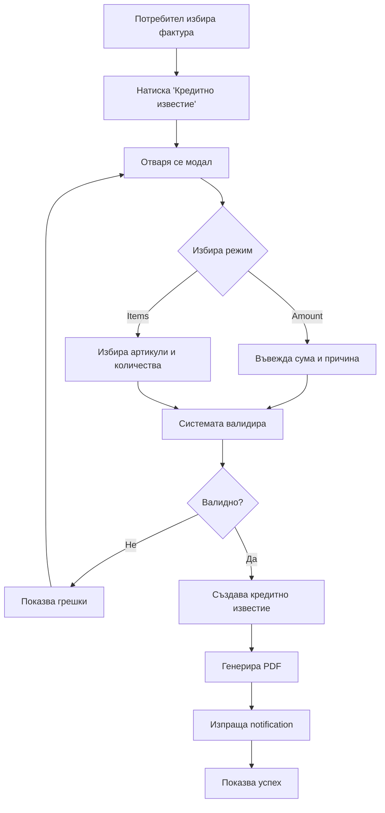

# 🧾 КРЕДИТНИ ИЗВЕСТИЯ - Пълна архитектура

## 📋 ОБЗОР

Модулът за кредитни известия позволява създаване на корекции към оригинални фактури за:
- **Корекция на сума** (credit_amount) - например грешна цена
- **Корекция на артикули** (credit_items) - например върнато количество

## 🗄️ DATABASE (ГОТОВО ✅)

Базата данни е готова според проектното знание:

```sql
-- Основна таблица invoices с поддръжка за кредитни известия
invoice_category = 'credit_note'
invoice_type = 'credit_amount' | 'credit_items'
original_invoice_id - връзка към оригиналната фактура

-- Поддържащи таблици
invoice_items - артикулите в кредитното известие
invoice_payments - плащания (негативни за кредитни известия)
```

## 🔌 BACKEND API - ПЛАН ЗА ИМПЛЕМЕНТАЦИЯ

### 1. Основен Controller (4 часа)

```javascript
// /controllers/creditNotesController.js

class CreditNotesController {
  // Създаване на кредитно известие
  async createCreditNote(req, res) {
    const { variant_id } = req.params;
    const { 
      original_invoice_id, 
      mode, // 'amount' | 'items'
      amount, 
      items, 
      reason 
    } = req.body;
    
    // 1. Валидации
    // 2. Проверка на оригиналната фактура
    // 3. Създаване на кредитното известие
    // 4. Генериране на PDF
    // 5. Response с новото кредитно известие
  }
  
  // Списък кредитни известия за вариант
  async getCreditNotesByVariant(req, res) {}
  
  // Детайли за кредитно известие
  async getCreditNoteDetails(req, res) {}
  
  // Изпращане на кредитно известие по email
  async sendCreditNote(req, res) {}
}
```

### 2. Бизнес логика сервиз (3 часа)

```javascript
// /services/creditNotesService.js

class CreditNotesService {
  // Валидация на данните
  async validateCreditNoteData(data) {
    // - Проверка дали оригиналната фактура съществува
    // - Проверка дали не е вече кредитирана напълно
    // - Валидация на количества/суми
    // - Проверка на права
  }
  
  // Изчисляване на суми за кредитно известие
  async calculateCreditAmounts(originalInvoice, creditData) {
    // - За amount mode: директно изчисление
    // - За items mode: сума на върнатите артикули
    // - ДДС изчисления
    // - Валидация че не превишава оригинала
  }
  
  // Създаване на кредитно известие
  async createCreditNote(creditData, transaction) {
    // - Генериране на номер
    // - Създаване в базата
    // - Създаване на артикулите
    // - Обновяване на статуса на оригинала
  }
}
```

### 3. API Routes (1 час)

```javascript
// /routes/creditNotes.js

router.post('/variant/:variant_id/credit-note', 
  auth.required,
  validateCreditNote,
  creditNotesController.createCreditNote
);

router.get('/variant/:variant_id/credit-notes',
  auth.required,
  creditNotesController.getCreditNotesByVariant
);

router.get('/credit-note/:id',
  auth.required,
  creditNotesController.getCreditNoteDetails
);

router.post('/credit-note/:id/send',
  auth.required,
  creditNotesController.sendCreditNote
);
```

## ⚛️ FRONTEND COMPONENTS - ПЛАН ЗА ИМПЛЕМЕНТАЦИЯ

### 1. Основен компонент за създаване (6 часа)

```jsx
// /components/CreditNotes/CreateCreditNoteModal.jsx

const CreateCreditNoteModal = ({ originalInvoice, onClose, onCreated }) => {
  const [mode, setMode] = useState('amount'); // 'amount' | 'items'
  const [reason, setReason] = useState('');
  const [amount, setAmount] = useState(0);
  const [selectedItems, setSelectedItems] = useState([]);
  
  // UI логика за двата режима
  // Валидации в реално време
  // Предварителен изчисления
  // Submit логика
};
```

### 2. Списък с кредитни известия (3 часа)

```jsx
// /components/CreditNotes/CreditNotesList.jsx

const CreditNotesList = ({ variantId }) => {
  // Показва всички кредитни известия за варианта
  // Филтриране и търсене
  // Actions: преглед, изпращане, PDF
};
```

### 3. Преглед на кредитно известие (2 часа)

```jsx
// /components/CreditNotes/CreditNoteDetails.jsx

const CreditNoteDetails = ({ creditNoteId }) => {
  // Показва детайлите на кредитното известие
  // Връзка към оригиналната фактура
  // Статус на изпращане
  // Actions панел
};
```

### 4. Интеграция във фактурния модул (2 часа)

```jsx
// Добавяне на бутон "Кредитно известие" в екрана с фактури
// Интеграция в общия списък с фактури
// Breadcrumb навигация
```

## 📄 PDF GENERATION (ГОТОВО ✅)

PDF темплейтът е готов според проектното знание. Нужна само интеграция:

```javascript
// /services/pdfService.js

async generateCreditNotePDF(creditNote) {
  // Използва готовия HTML темплейт
  // Попълва данните
  // Генерира PDF
  // Запазва файла
}
```

## ✅ VALIDATION RULES

### Бизнес правила за валидация:

1. **Оригинална фактура**:
   - Трябва да съществува и да е издадена
   - Не може да е вече кредитирана напълно

2. **Amount mode**:
   - Сумата не може да надвишава остатъка от оригинала
   - Минимална сума 0.01

3. **Items mode**:
   - Артикулите трябва да съществуват в оригинала
   - Количествата не могат да надвишават оригиналните
   - Поне един артикул трябва да е избран

4. **Общи**:
   - Причината е задължителна
   - Само потребители с права могат да създават

## 🔄 WORKFLOW



## 📅 ПЛАН ЗА ИМПЛЕМЕНТАЦИЯ (4-5 дни)

### Ден 1: Backend API
- [ ] CreditNotesController - основни методи (4h)
- [ ] CreditNotesService - бизнес логика (3h)
- [ ] API routes и middleware (1h)

### Ден 2: Валидации и тестове  
- [ ] Валидации и error handling (3h)
- [ ] Unit tests за сервиза (2h)
- [ ] Integration tests за API (3h)

### Ден 3: Frontend компоненти
- [ ] CreateCreditNoteModal - пълна функционалност (6h)
- [ ] Интеграция с API (2h)

### Ден 4: UI завършване
- [ ] CreditNotesList компонент (3h)
- [ ] CreditNoteDetails компонент (2h)
- [ ] Интеграция във фактурния модул (3h)

### Ден 5: Финализиране
- [ ] PDF генериране и интеграция (2h)
- [ ] Email функционалност (2h)
- [ ] End-to-end тестове (2h)
- [ ] Bug fixes и полиране (2h)

## 🎯 КЛЮЧОВИ ФАЙЛОВЕ ЗА СЪЗДАВАНЕ

### Backend:
```
/api/controllers/creditNotesController.js
/api/services/creditNotesService.js  
/api/routes/creditNotes.js
/api/middleware/validateCreditNote.js
/api/tests/creditNotes.test.js
```

### Frontend:
```
/src/components/CreditNotes/CreateCreditNoteModal.jsx
/src/components/CreditNotes/CreditNotesList.jsx
/src/components/CreditNotes/CreditNoteDetails.jsx
/src/services/creditNotesAPI.js
/src/hooks/useCreditNotes.js
```

## 🚀 ГОТОВ ЗА СТАРТ!

Всичко е планирано и готово за имплементация. Кредитните известия ще бъдат пълноценен модул за:
- ✅ Създаване на корекции по суми и артикули
- ✅ Автоматично PDF генериране  
- ✅ Email изпращане
- ✅ Пълна интеграция с фактурния модул
- ✅ Audit trail и история

**Следваща стъпка**: Започваме с Backend API контролерите! 💪